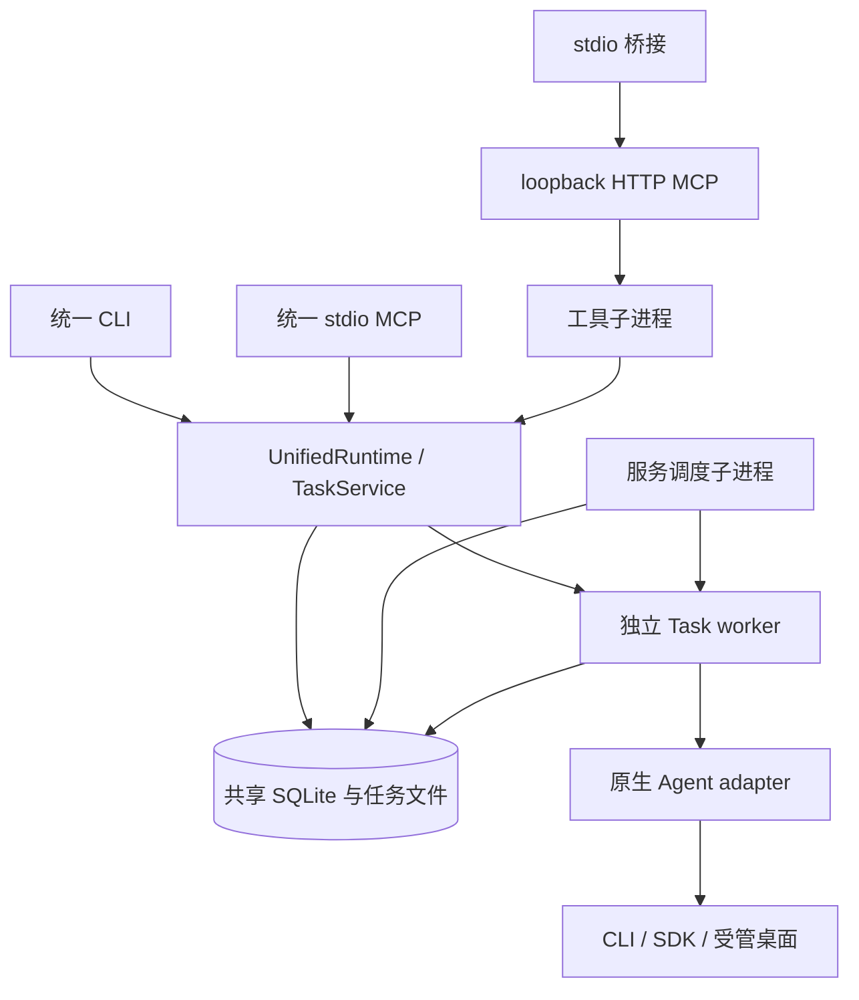

# 当前架构

uAgents 由入口层、共享 Node.js Core、独立 Task worker 和原生 Agent 适配器组成。CLI、stdio MCP 和本地 HTTP 服务复用同一请求与状态协议；选择入口不会改变 Task 身份。

## 组件与执行路径

| 组件 | 当前职责 |
| --- | --- |
| CLI / MCP | 解析参数或 schema，返回统一 envelope；MCP 宿主附件在进入 Core 前转换 |
| Registry / policy | 解析 target、model、默认路线和 capability，校验请求与附件 |
| TaskService | 注册 Task/Attempt、处理幂等、租约和取消意图，持久化状态与结果 |
| UnifiedRuntime | 组合 Task、Council、模型发现和受管生命周期接口 |
| Task worker / adapter | 获取执行所有权，准备输入，调用原生 Agent，记录发送与终态证据 |
| Target Supervisor | 验证安装与进程身份，启动、复用或停止受管实例 |
| CouncilService | 管理成员 Task、隔离工作树、验证证据、采用和清理 |
| 本地服务 | 在 HTTP 前执行认证与范围检查，用工具和调度子进程处理 Core 操作 |

CLI 和原 stdio MCP 注册任务后启动独立 worker；服务工具子进程只登记新任务，由调度器扫描安全未发送的队列并启动 worker。服务的 `resume` 等显式生命周期工具仍沿用 Core 规则，调度进程与 Task worker 分别拥有自己的生命周期。

## 持久化与身份

状态根目录由显式参数、`UAGENTS_STATE_DIR` 或 `%LOCALAPPDATA%\uAgents\v1` 确定。各入口只有使用同一目录才共享记录。

- SQLite 保存 Task、Attempt、幂等键、事件、租约和原生执行记录。
- 任务文件保存归一化请求、Prompt payload、结果、附件快照和捕获的 artifacts；目录组织由 Core 管理。
- Council 在状态目录中保存请求、manifest 和成员 worktree，成员本身仍是普通 Task。
- 模型目录与安装/受管实例证据由 HostStore 管理；目录缓存不证明 Provider 可用性。

相同 `request_id` 和相同有效请求返回原 Task/Attempt；同 UUID 内容不同返回 `request_conflict`。新会话轮次和 Council 成员各有自己的 Task 身份。

## 并发与恢复

Task、workspace 和原生执行所有权使用 SQLite lease/fencing。外部发送前写入 `possibly_sent`；发送后证据不足时保留不确定状态。

服务调度器使用独立 leader lease，只接管符合范围、`registered/queued`、`submission=not_sent` 且没有活跃所有权或原生发送证据的任务。它复用原 Attempt；已有 worker 的活跃租约计入容量。

Council 的 submit、validate、adopt 和 cleanup 使用每 Council 的共享租约，写入 manifest 或执行受控修改前检查 fencing。验证操作预留所选成员与命令的完整超时预算。

恢复、取消和 timeout 的结果由目标的原生证据决定；具体规则见 [Runtime](runtime.md)、[会话](sessions.md) 和 [服务](service.md)。

## 运行边界

uAgents 管理调度与记录，原生权限由目标配置、启动策略及运行环境控制。服务只绑定 loopback，使用 Bearer、Host/Origin 检查和 target/tool/workspace 范围；这些限制约束调度 API，不构成原生执行沙箱。

附件路径经过 realpath、快照和发送前核对；Council 的文件比较与采用检查文件类型和目录范围。范围与操作细节分别见 [附件](attachments.md)、[Council](council.md) 和 [Service Reference](../reference/service.md)。

源码入口为 `plugins/uagents/src/runtime/`、`src/service/`、`src/adapters/` 和 `mcp/unified/src/`；构建方式见 [开发与验证](../development.md)。
