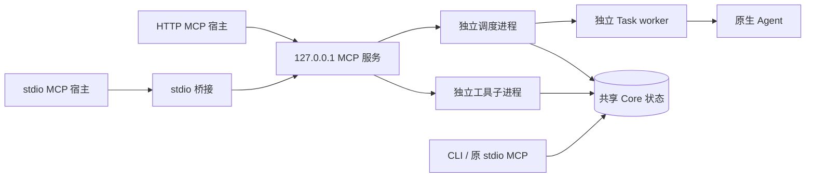

# 共享本地编排服务

uAgents 可以作为独立的本地进程运行，让 WorkBuddy、Codex、Claude Code 或其它 MCP 宿主使用同一套 Task / Attempt / Council。调用方登记与查询任务，服务负责本机派发。



## 初始化与启动

需要 Node.js `>=22.13.0`，以及执行目标自身的安装、登录和配置。仓库开发环境先构建；分发的插件包含 MCP bundles，无需安装运行时 npm 依赖。

```powershell
npm --prefix plugins/uagents/mcp/unified ci --ignore-scripts
npm --prefix plugins/uagents/mcp/unified run build

$taskPlugin = 'F:\documents\software\uAgents\plugins\uagents'
$taskConfig = Join-Path $env:LOCALAPPDATA 'uAgents\service-v1\config.json'
node "$taskPlugin\bin\uagents-service.mjs" init --config "$taskConfig" `
  --workspace 'F:\documents\software' --target opencode --target agy
node "$taskPlugin\bin\uagents-service.mjs" serve --config "$taskConfig"
```

`--workspace` / `--target` 可重复。workspace root 是允许调用方提交任务的目录范围；init 未指定 target 时允许八个内置目标。默认端口 `4319`，默认 state directory `%LOCALAPPDATA%\uAgents\v1`。可通过 `--port` / `--state-dir` 修改；用 `--registry-config <绝对路径>` 固定模型路线与默认值。

服务应从独立的用户会话终端或后台进程启动。受限 Agent 宿主可能在命令结束时回收自己启动的进程。Windows 可从普通 PowerShell 窗口启动后台服务：

```powershell
$taskNode = (Get-Command node).Source
$taskArguments = '"{0}" serve --config "{1}"' -f "$taskPlugin\bin\uagents-service.mjs", $taskConfig
$taskService = Start-Process -FilePath $taskNode -ArgumentList $taskArguments `
  -WindowStyle Hidden -PassThru
node "$taskPlugin\bin\uagents-service.mjs" health --config "$taskConfig"
```

前台服务用 Ctrl+C 停止；后台服务由启动管理器停止。停止会关闭 HTTP 接口和调度器，已启动的 Task worker 保持自己的生命周期。重新启动会扫描可安全恢复的未发送队列。服务不自动添加开机启动项。

init 生成随机 Bearer token，仅输出文件路径。配置、token 和其直接父目录必须是当前用户私有的普通文件/目录；新建专用目录会设置 Windows DACL 或 POSIX `0700/0600`。已有共享目录被拒绝，已有配置/token 不会覆盖。启动和桥接核验权限。不要把它们放进项目、版本控制或提示词。

## 宿主接入

支持 Streamable HTTP MCP 的宿主连接 `http://127.0.0.1:4319/mcp`，并在宿主的私密认证设置中配置 `Authorization: Bearer <token文件中的值>`。应用的配置格式各异，uAgents 不读取供应商专有配置。

只支持 stdio MCP 的宿主可使用以下模板，修改为自己的插件和配置路径：

```json
{
  "mcpServers": {
    "uagents-service": {
      "command": "node",
      "args": [
        "F:\\documents\\software\\uAgents\\plugins\\uagents\\bin\\uagents-mcp-bridge.mjs",
        "--config",
        "C:\\Users\\24590\\AppData\\Local\\uAgents\\service-v1\\config.json"
      ]
    }
  }
}
```

桥接只持有 HTTP 连接，任务执行由独立服务完成。也可用 `--endpoint http://127.0.0.1:4319/mcp --token-file <绝对路径>`，token 内容不进入 argv。宿主需要能够启动 Node；禁止子进程但允许本机网络的环境应使用原生 HTTP MCP。如果两者都禁止，需要宿主开放受支持的连接方式。

连接后用 `tools/list` 读取 schema，默认公开原有 20 个 `uagents_*` 工具。支持现代 MCP 和旧版 initialize / POST；旧版持久 SSE GET / DELETE 返回 `405`。官方 SDK 桥接兼容 JSON / SSE 响应。

给调用 Agent 的最小工作说明：

```text
先读取 tools/list、目标能力和模型证据。
每个有意的新任务生成一个 UUID，完整请求包含 schema_version、target、mode、workspace、prompt，必要时显式指定 model。
用 uagents_submit 登记，以原 UUID 调用 uagents_status / uagents_result。
同 UUID 只复用完全相同的请求；不同内容会报 request_conflict。
遇到 may_have_been_sent / indeterminate / 响应丢失，先查询原任务，不换 UUID 重发。
只发送任务所需且已获授权的文本和文件；执行权限沿用原生 Agent 配置。
Council 由调用方判断、验证与采用候选，不自动选择 winner 或 merge。
```

宿主不需要知道各 Agent 的 argv 协议。登录、模型额度与权限审批仍由原生应用处理。

## 运行与恢复边界

- HTTP 仅绑定 `127.0.0.1`，先检查 Host、Origin、Bearer 和字节上限。`GET /health` 同样认证，展示调度进度、错误计数与工具容量，不返回 token 或原生诊断文本。
- 服务限制 target、tool、workspace root，检查附件 realpath、session 父任务和持久化 Task/Council 范围。host 临时附件必须位于允许的 root；可使用已获授权的 inline blob。写入拒绝越界 junction 和已有目标链接。
- git-worktree Council 与 adopt 涉及整个 Git 仓库，因此实际仓库根目录也必须在允许的 root 内。diff 只读取工作树内的普通文件；外部链接只显示描述。
- Git、SQLite、模型发现等工具操作在子进程运行，健康接口保持响应。工具超时返回未确认错误，容量直到 close 才释放。断开 HTTP 连接不会取消已登记任务。
- 调度器使用共享 SQLite leader lease，仅恢复 registered/queued、`submission=not_sent`、无活跃所有权或原生证据的任务，复用原 Attempt。不自动重发 starting 孤儿、sent 或未知状态。
- `max_workers` 依据同 state directory 的活 task leases 和本实例尚未 claim 的 worker 计算，重启后仍计入已有 worker。其它 CLI 自身仍按 Core 的执行租约派发。
- CLI / 原 stdio / HTTP 只有使用同一 state directory 才共享记录。服务扫描该目录内符合 scope 的安全未发送任务，包括 CLI 登记的任务。需要独立队列时使用不同 `--state-dir`。
- Council submit / validate / adopt / cleanup 使用共享 Core 的每 Council 互斥与 fencing。验证租约预算覆盖所有选中成员/checks。进程退出后到期前可能返回 `lease_conflict`；服务不自动重跑验证。丢失响应后先查询 Council，确认旧验证及子进程已结束，再决定是否显式重试。
- 清理 worktree 或删除 workspace 后，任务历史仍可查询；新执行仍要求存在的 workspace。
- 原生任务不会直接继承服务 token 环境、Authorization 或 token 内容。这是同一 OS 用户的调度 API 边界；拥有该用户文件权限的 Agent 仍能访问该用户文件，scope 不构成执行沙箱。不同用户与远程调用需要额外身份和隔离设计。

配置修改后重启生效。机器可读入口为 `uagents-service.mjs describe` / `schema config`。字段见 [Service Reference](../reference/service.md)，验证记录见 [Verification](../verification/2026-10-03-shared-local-service.md)。
